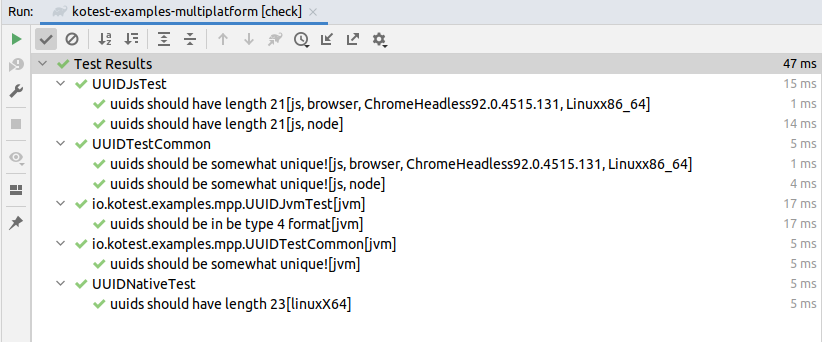

# kotest-examples-multiplatform

This project shows an example project with JVM, JS and native tests all running together with Kotest.

The project has a naive UUID implementation that is bespoke for each of the platforms, a shared test in `commonTest`
that runs on all platforms, and a individual test per platform which tests the unique properties of that platform's UUID
implementation.

To run tests: `./gradlew check`

Results should look something like:

